# Conteúdo da Prova 2

Esse documento é um resumo do conteúdo que corresponde à prova 2 da disciplina
de Algoritmos e Teoria de Grafos.

Sumário:

1.  [Busca em Grafos](#busca-em-grafos)
    1.  [Algoritmo Genérico de Busca](#algoritmo-genérico-de-busca)
    1.  [Busca em Largura](#busca-em-largura)
    1.  [Algoritmo de Jarnik-Prim](#algoritmo-de-jarnik-prim)
    1.  [Algoritmo de Dijkstra](#algoritmo-de-dijkstra)
    1.  [Busca em Profundidade](#busca-em-profundidade)
    1.  [Buscas em Grafos Direcionados](#buscas-em-grafos-direcionados)
1.  [Vértices e arestas de corte](#vértices-e-arestas-de-corte)
1.  [Componentes fortes](#componentes-fortes)
1.  [Emparelhamento](#emparelhamento)
1.  [Referências](#referências)

## Busca em Grafos

Algoritmos que processam cada vértice e cada aresta de um grafo.

Normalmente, nesses algoritmos os vértices possuem 3 estados:
1. V1: vértices cujas arestas já foram processadas.
2. V2: vértices cujas algumas arestas foram processadas, mas não todas.
3. V3: vértices que ainda não foram processados.

### Algoritmo Genérico de Busca

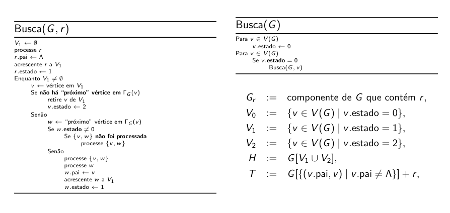

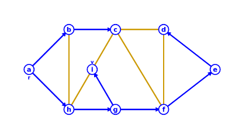

Diferentes árvores geradoras de são construídas, dependendo dos vértices
escolhidos em cada iteração.

#### Componentes Conexos

Uma aplicação do Algoritmo Genérico de Busca é encontrar os componentes conexos.

Ideia: marca todos os vértices do componente com um mesmo número.

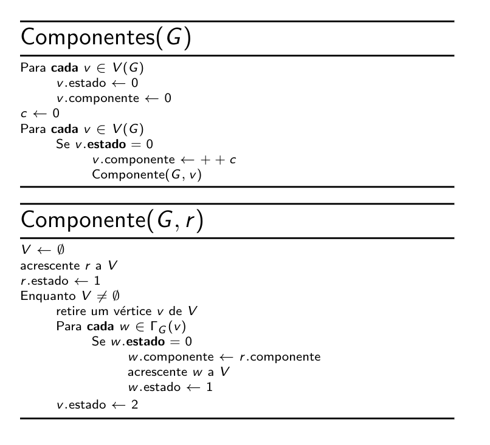

Complexidade: O(n + m).

### Busca em Largura

Uma busca em que os vértices são processados em ordem não decrescente de
distância de r (raíz).

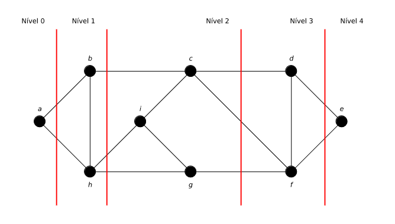

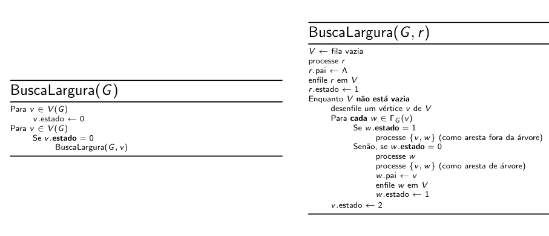

#### Teorema

Se F é a floresta direcionada resultante de uma busca em largura sobre um grafo
G, então toda aresta fora de F é **cruzada** com relação a F.

#### Teorema

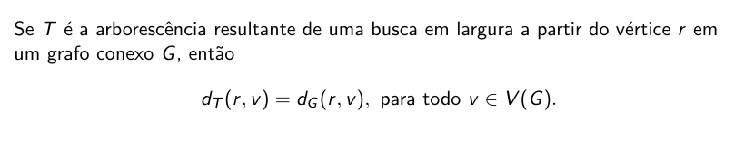

#### Corolário (Caminhos mínimos)

Se (T, r) é a árvore enraizada resultante de uma busca em largura em um grafo
conexo G, então rTv é um caminho mínimo em G para todo v em V(G).

#### Bipartição

Teorema: Seja (T, r) a árvore enraizada resultante de uma busca em largura
sobre um grafo conexo G. O grafo G é bipartido se, e somente se, d(r, u) e d(r,
v) tem paridades diferentes para toda aresta {u, v} em E(G - T).

### Algoritmo de Jarnik-Prim

Algoritmo para encontrar uma árvore geradora mínima (árvore geradora de G de
peso mínimo).

#### Algoritmo de Prim

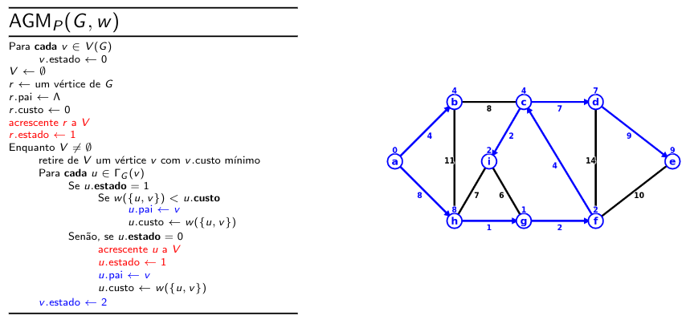

AGMp(G, w) executa em tempo O(m.log(n)).

### Algoritmo de Dijkstra

rTv é caminho mínimo em G para todo v em V(G).

O Dijkstra encontra a árvore de caminhos mínimos. Parece o de Prim.

Teorema: para todo v em V(G) existe uma árvore de caminhos mínimos enraizada em v.

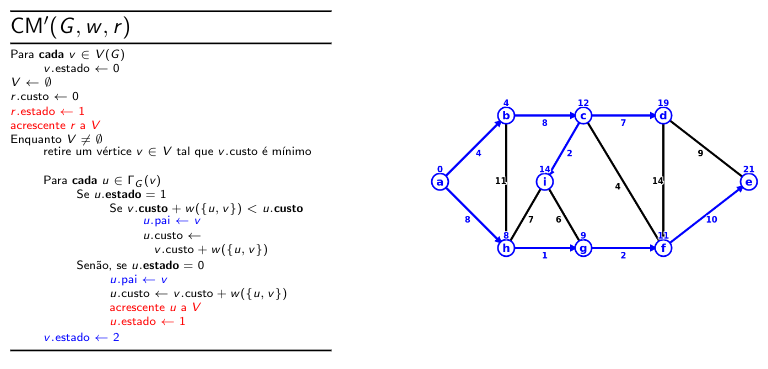

Complexidade: O(m.log(n). "Mesmo" algoritmo de Jarnik-Prim.

#### Corolário

G: grafo com n vértices e m arestas.

É possível computar em tempo O(n.m.log(n)):
1. distâncias entre todos os pares de vértices de G.
2. diâmetro de G.

### Busca em Profundidade

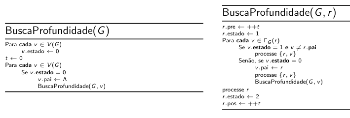

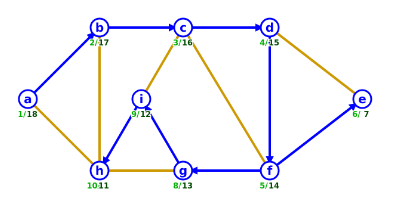

Seja F a floresta resultante da execução de BuscaProfundidade(G), então
1.  BuscaProfundidade(G, r) processa a árvore enraizada (T, r) e as arestas de
    G - F que ligam descendentes e ancestrais de r.
2.  v.pre é o **índice de pré-ordem** de v, que indice o "momento" de início do
    processamento da subárvore de T de raiz v ("DFS number").
3.  v.pos é o **índice de pós-ordem** de v, que indice o "momento" do fim do
    processamento da subárvore de T de raiz v.
4.  ao final, t = 2n, sendo n o número de vértices em G.

#### Teorema

Se F é a floresta resultante de uma busca em profundidade em um grafo G e u é
ancestral de v em F, então u.pre < v.pre < v.pos < u.pos.

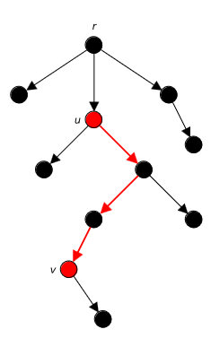

#### Teorema

Se F é a floresta resultante de uma busca em profundidade de um grafo G, então
toda aresta em G - F é de retorno com relação a F.

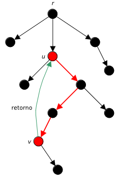

### Buscas em Grafos Direcionados

Mesma coisa, só que agora a busca é em grafos direcionados.

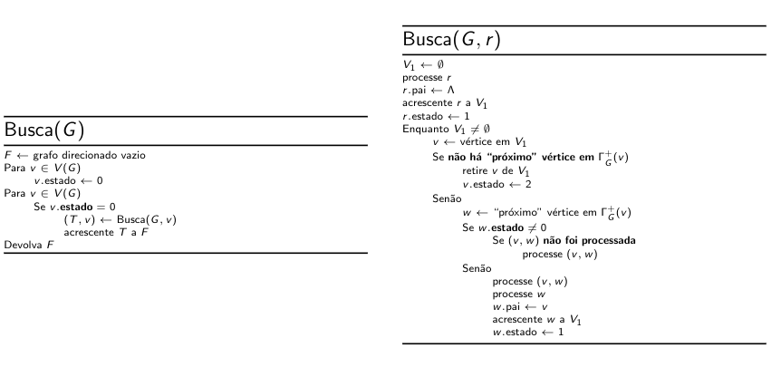

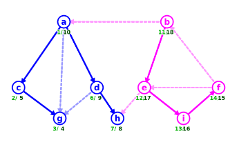

1.  A busca a partir do vértice v devolve uma arborescência de raiz v em vez de
    uma árvore enraizada em v.
2.  Pode devolver florestas direcionadas, mesmo quando o grafo é conexo.
3.  Pode haver arcos cruzados em uma floresta direcionada gerada por uma busca
    em profundidade.
4.  Se T é a árborescência resultante de uma busca no grafo direcionado G,
    então V[T] é o conjunto dos vértices de G alcançáveis a partir de v em G.

#### Teorema

F: floresta direcionada resultante de uma busca em profundidade sobre o grafo direcionado G.

v.pre e v.pos: índices de pré-ordem e pós-ordem computados.

O arco (u, v), com relação a F é:
1.  arco de avanço se, e somente se, `u.pre < v.pre < v.pos < u.pos`.
2.  arco cruzado se, e somente se, `v.pre < v.pos < u.pre < u.pos`.
3.  arco de retorno se, e somente se, `v.pre < u.pre < u.pos < v.pos`.

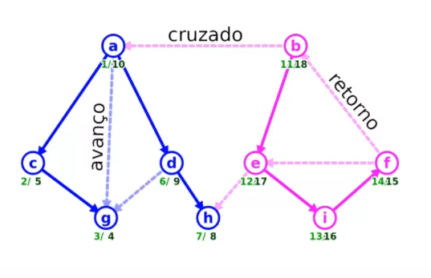

#### Ordem

A ordem < induzida sobre V(G) dada por:
1.  u < v := u.pre < v.pre - para todo u e v em V(G) - é uma pré-ordem de F.
2.  u < v := u.pos < v.pos - para todo u e v em V(G) - é uma pós-ordem de F.

#### Teorema

O grafo condensado de um grafo direcionado é acíclico.

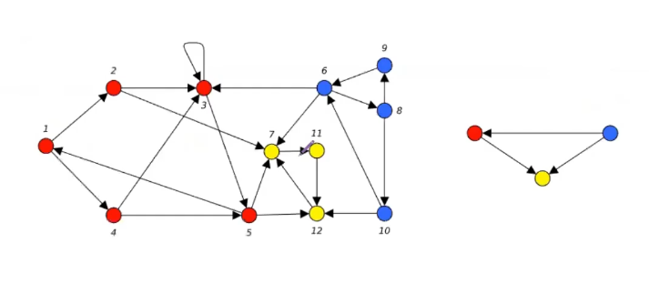

#### Ordenação topológica

Dado um grafo direcionado G. Uma **ordenação topológica** de G é uma permutação
dos vértices de V(G) que "respeita a direção dos arcos" de G.

#### Teorema

Um grafo direcionado G admite ordenação topológico se, e somente se, é acíclico.

#### Teorema

Um grafo direcionado G é acíclico se, e somente se, qualquer floresta
direcionada resultante de uma busca em profundidade sobre G não tem arcos de
retorno.

#### Teorema

O reverso da pós-ordem de uma floresta direcionada resultante de uma busca em
profundidade em um grafo direcionado acíclico G é uma ordenação topológica de G.

#### Algoritmo de ordenação topológica

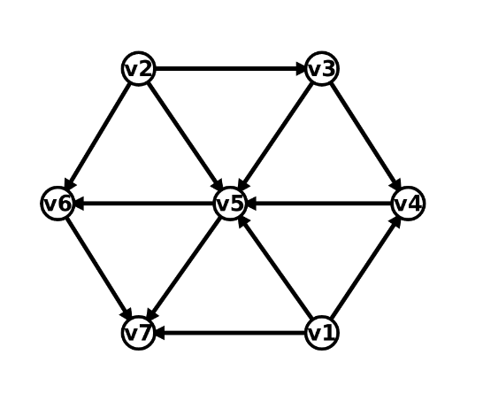

G.l = [v3, v1, v4, v5, v6, v7]

## Vértices e arestas de corte

### Teorema

Seja (T, r) uma árvore enraizada geradora de um grafo G produzida por uma busca
em profundidade.

1.  O vértice v é vértice de corte em G se, e somente se:
    1.  v = r e tem mais de um filho, ou,
    2.  v != r e tem um filho w tal que nenhum descendente de w é vizinho de
        um ancestral próprio de v.
2.  A aresta {u, v} é aresta de corte em G se, e somente se, u é pai de v em T
    e nenhuma outra aresta em G liga um descendente de v a um ancestral de u.

### Low point

(T, r): árvore enraizada produzida por uma busca em profundidade.

Low point de v com relação a T é o nível do vértice mais ancestral dentre v e
os vizinhos de seus descendentes por arestas de E(G) - E(T).

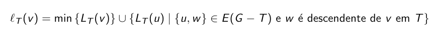

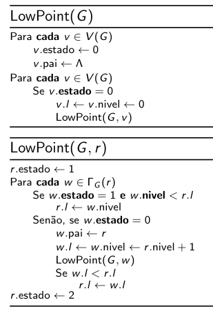

### Corolário

1.  O vértice v é vértice de corte em G se, e somente se:
    1.  v = r e tem mais de um filho, ou,
    2.  v != r e nível(v) <= low-point(w) para algum filho w de v em T.
2.  A aresta {u, v} é aresta de corte em G se, e somente se, u é pai de v em T
    e nível(u) < low-point(v).

## Componentes fortes

### Teorema

Se S é o sumidouro do grafo condensado de G e T é árvore resultante de uma
busca em G a partir de um vértice de S, então G[V(T)] = S.

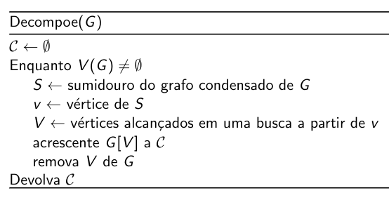

### Teorema

O vértice de maior pós-ordem está em uma fonte.

### Corolário

O vértice de maior pós-ordem do grafo transposto de um grafo direcionado G é
vértice de um sumidouro do grafo condensado de G.

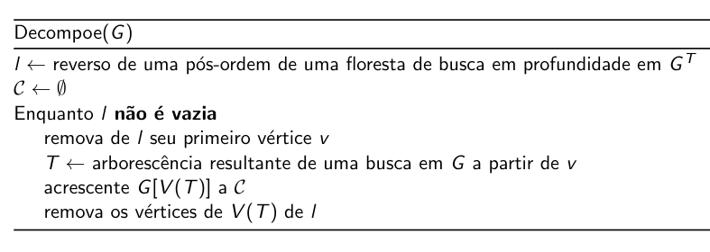

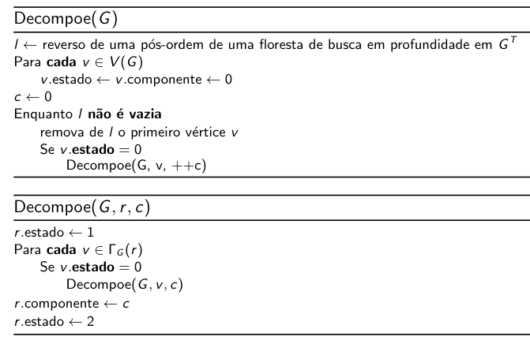

## Emparelhamento

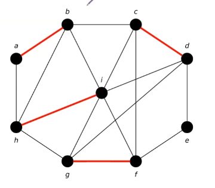

Um **emparelhamento** ("matching") em um grafo G é um conjunto de arestas de G
sem vértices em comum.

### Coloração de arestas

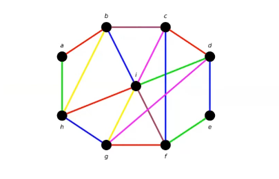

**Coloração de arestas** de uma grafo G: partição de E(G) em emparelhamentos.
Cada emparelhamento é uma cor de coloração.

**Indice cromático** de G: menor número de cores distintas necessário para
colorir as arestas de um grafo.

#### Teorema de Vizing

#### Teorema de Holyer

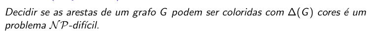

### Caminho M-aumentante

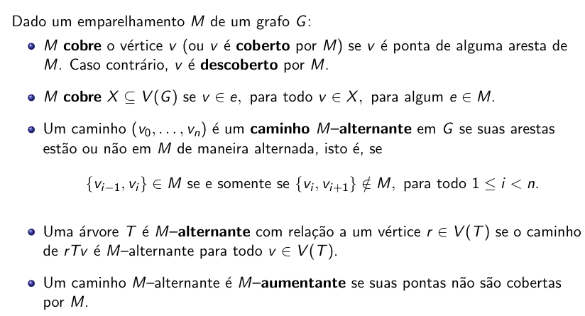

### Diferença simétrica

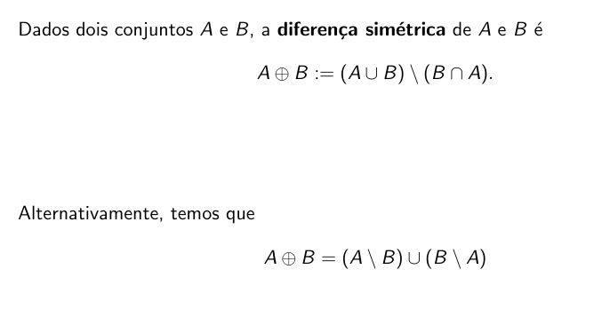

União do que está só em A com o que está só em B.

### Teorema

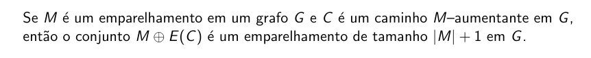

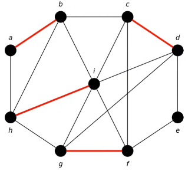

### Teorema de Berge

O emparelhamento M é máximo no grafo G se, e somente se, não existe caminho
M-aumentante em G.

### Teorema de Hall

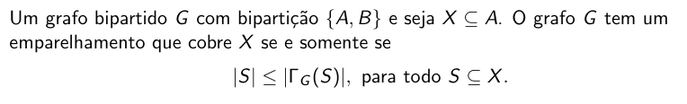

### Algoritmo de emparelhamento

## Referências

* <https://www.inf.ufpr.br/murilo/ci1065/ci1065.html>
* <https://www.inf.ufpr.br/murilo/ci1065/slides/>
* <https://www.inf.ufpr.br/renato/ci1065/>

