# Prova 1 de Design

## Introdução a Engenharia de Software

Fase de Elaboração:
- Construa a arquitetura central.
- Resolva os elementos de alto risco.
- Defina a maioria dos requisitos.
- Estime o cronograma geral e os recursos.

Modelagem de Domínio:
- Identificar classes conceituais relacionadas com os requisitos da
  iteração corrente.
- Criar um modelo de domínio inicial.
- Modelar os atributos e associações adequadas.

Modelo de domínio:
- Representação visual de classes conceituais, ou objetos do mundo
  real, em um domínio.
- Significa uma representação de classes conceituais do mundo real,
  não de objetos de software.
- Também chamado de modelos conceituais, modelos de objetos do
  domínio e modelos de objetos da análise.

Associações:
- Incluir associações para as quais o conhecimento do relacionamento
  precisa ser preservados por algum tempo ou se são associações
  derivadas da Lista de Associações Comuns.
- NomeDaClasse-FraseComVerbo-NomeDaClasse.

Atributos:
-   Inclua atributos para os quais os requisitos sugerem ou implicam
    a necessidade de memorizar informações.
-   Relacione classes conceituais com uma associação, não com um
    atributo.
-   Represente o que a princípio poderia ser considerado um número
    ou uma cadeia como uma nova classe de tipos de dados no modelo
    de domínio se:
    - Ela for composta de seções separadas. Número de telefone, nome
      de pessoa.
    - Existirem operações associadas a ela, como análise sintática
      ou validação. Número de CPF.
    - Ela tiver outros atributos. Um preço promocional pode ter uma
      data de início (de entrada em vigor) e uma de fim.
    - Ela for uma quantidade com uma unidade. A quantia paga tem uma
      unidade monetária.
    - Ela for uma abstração de um ou mais tipos com algumas dessas
      qualidades. Identificador de item no domínio de vendas é uma
      generalização de tipos, como Código Universal de Produto (CUP)
      e European Article Number (EAN).

## Diagramas de Sequência do Sistema

- Um diagrama de sequência do sistema é uma figura que mostra, para
  um cenário específico de um caso de uso, os eventos que os atores
  externos geram, sua ordem e os eventos entre sistemas.

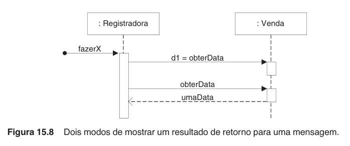

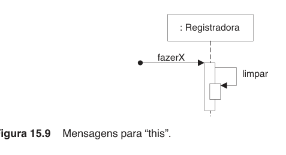

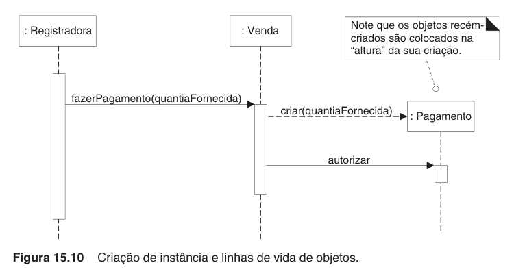

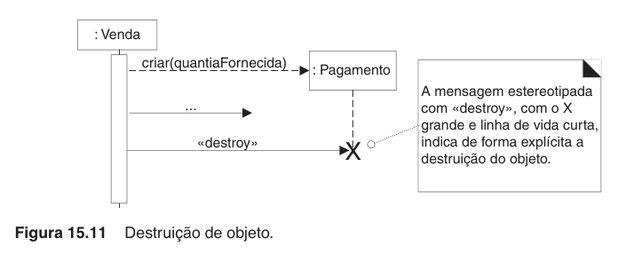

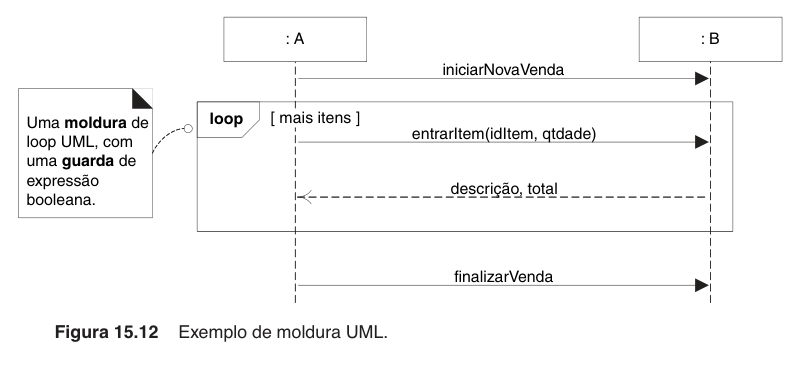

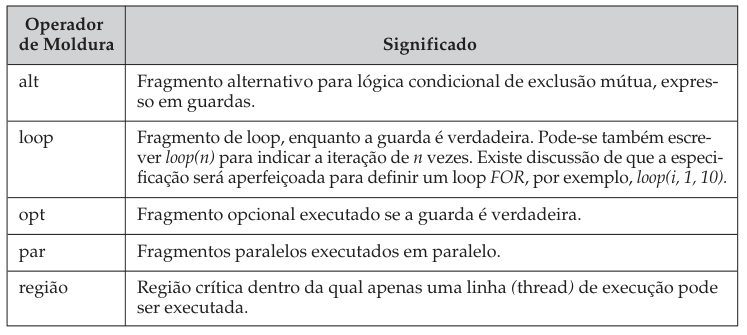

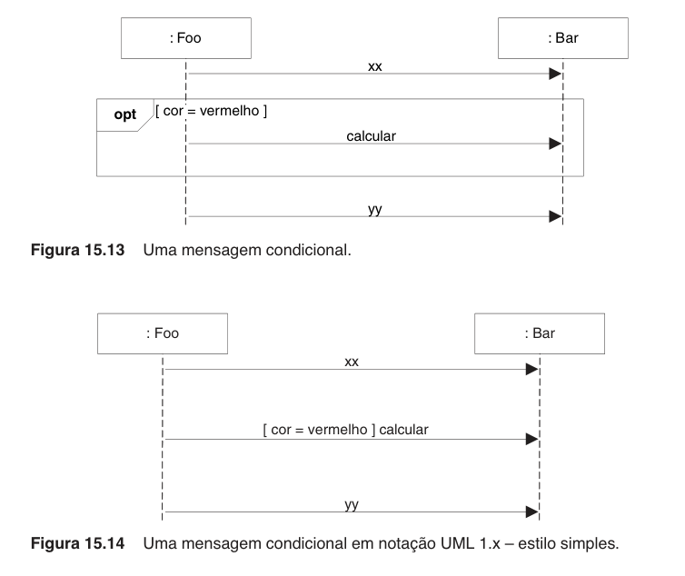

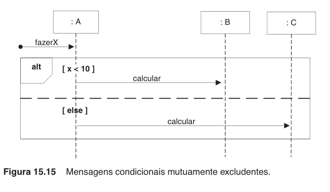

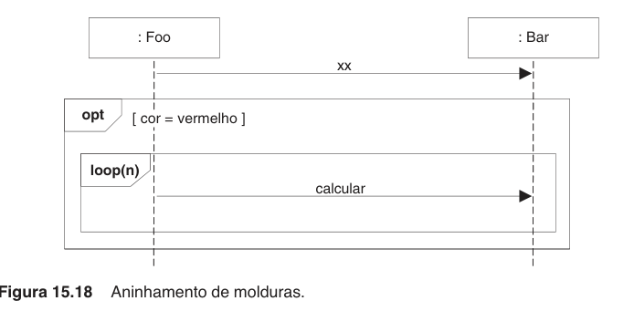

## Contratos de Operação

-   Operação:
    - Nome da operação e parâmetros.
-   Referências Cruzadas:
    - Casos de uso nos quais essa operação pode ocorrer.
-   Pré-Condições:
    - Hipóteses dignas de notas sobre o estado do sistema ou de objetos no
      Modelo de Domínio antes da execução da operação. São hipóteses não
      triviais que o leitor deveria saber que foram formuladas.
-   Pós-Condições:
    - É a seção mais importante.
    - O estado dos objetos no Modelo de Domínio, depois de concluída a
      operação.
    - Criação e exclusão de instância.
    - Modificação de valor de atributo.
    - Associações formadas e desfeitas.

## Diagramas de Comunicação

- Mesma coisa que o DSS, mas mudando a notação.

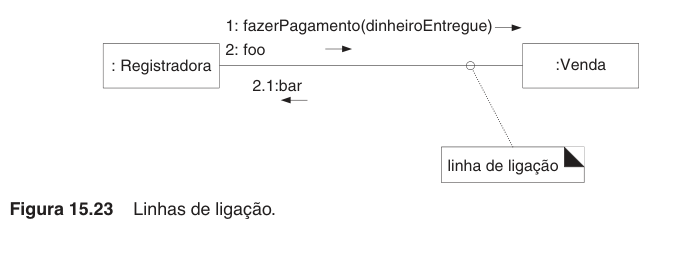

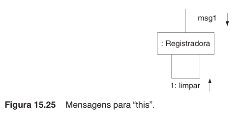

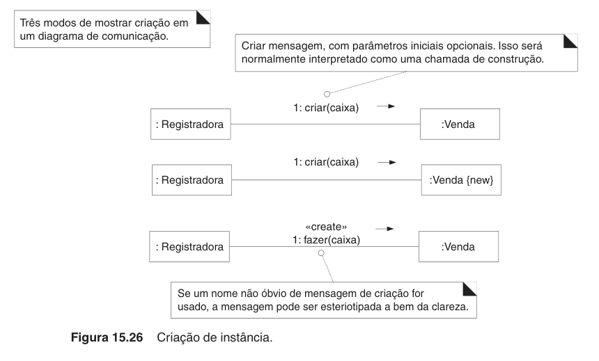

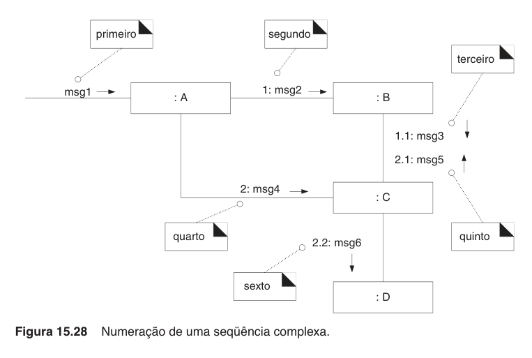

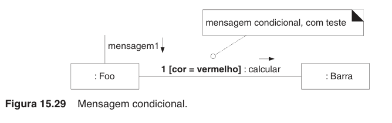

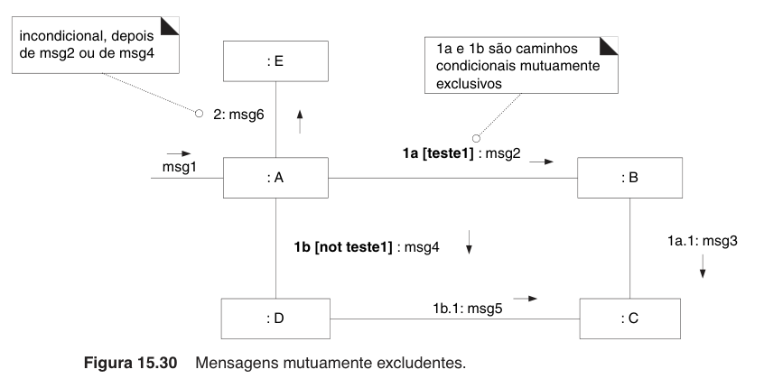

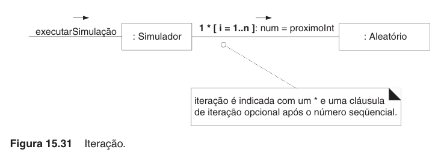

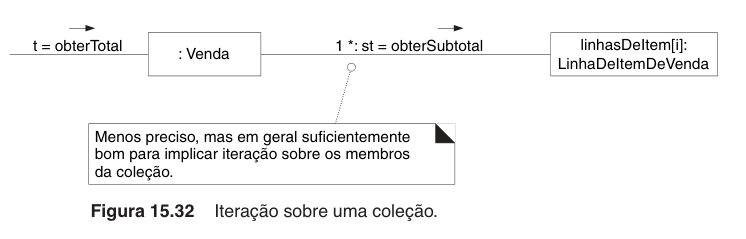

## Padrões GRASP

### Criador

-   Nome: Criador.
-   Problema: quem cria A?
-   Solução: atribuir à classe B a reponsabilidade de criar uma instância da
    classe A se uma das seguintes afirmativas for verdadeira:
    - B "contém" A, ou agrega A de forma composta.
    - B registra A
    - B usa A de maneira muito próxima.
    - B contém os dados iniciais de A.

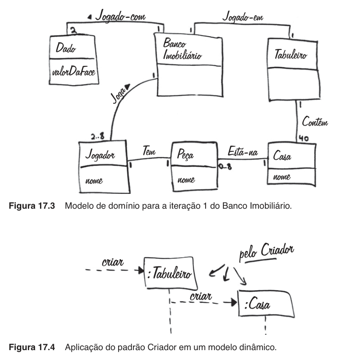

### Especialista na informação

-   Nome: Especialista na informação (frequentemente só Especialista).
-   Problema: Qual é o princípio básico pelo qual atribuir responsabilidades a
    objetos?
-   Solução: Atribua responsabilidade à classe que tenha informação necessária
    para satisfazê-la.

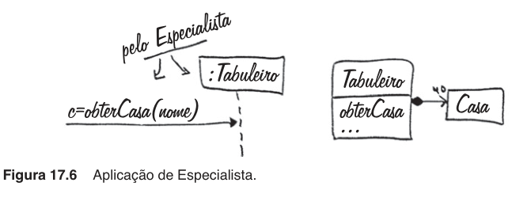

### Acoplamento baixo

-   Nome: Acoplamento baixo.
-   Problema: Como reduzir o impacto de modificações?
-   Solução: Atribuir responsabilidades de modo que acoplamento
    (desnecessário) permaneça baixo. Use esse princípio para avaliar
    alternativas.

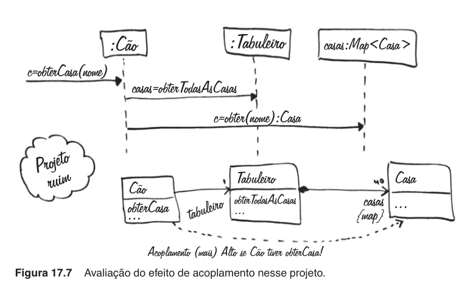

Aplicação de UML: por favor, observe alguns elementos UML no diagrama de se-
qüência da Figura:
-   A variável de retorno de valor casas da mensagem obterTodasAsCasas também
    é usada para denominar o objeto linha de vida em casas: Map\<Casa\> (por
    exemplo, uma coleção do tipo Map que contém objetos Casa). Referenciar uma
    variável de retorno de valor em uma caixa de linha de vida (para enviar
    mensagens a ela) é comum.
-   A variável c na mensagem obterCasa inicial e a variável c na última
    mensagem obter referem-se ao mesmo objeto.
-   A expressão c = obter(nome) : Casa na mensagem indica que o tipo de c é
    uma referência a uma instância de Casa.

### Controlador

-   Nome: Controlador.
-   Problema: Qual é o primeiro objeto, além da camada de IU, que recebe e
    coordena ("controla") uma operação do sistema?
-   Solução: Atribuir a responsabilidade a um objeto que representa uma dessas
    escolhas:
    - Representa todo o "sistema", um "objeto raiz", um dispositivo dentro do
      qual o software está sendo executado, ou um subsistema importante (todas
      essas são variações de um controlador fachada).
    - Representa um cenário de caso de uso dentro do qual a operação do
      sistema ocorre (um caso de uso ou um controlador de sessão).

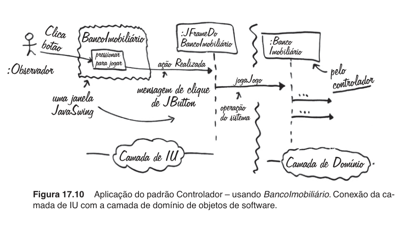

### Coesão alta

-   Nome: Coesão alta.
-   Problema: Como manter os objetos focados, inteligíveis e gerenciáveis e,
    como efeito colateral, apoiar Acomplamento baixo?
-   Solução: Atribuir responsabilidades de modo que a coesão permaneça alta.
    Use isso para avaliar alternativas.

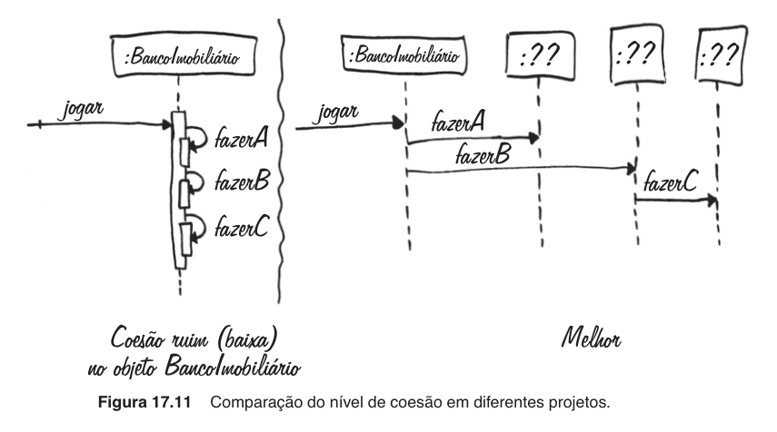
