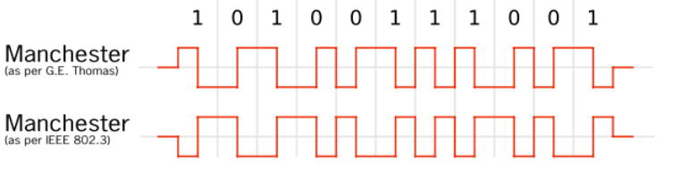
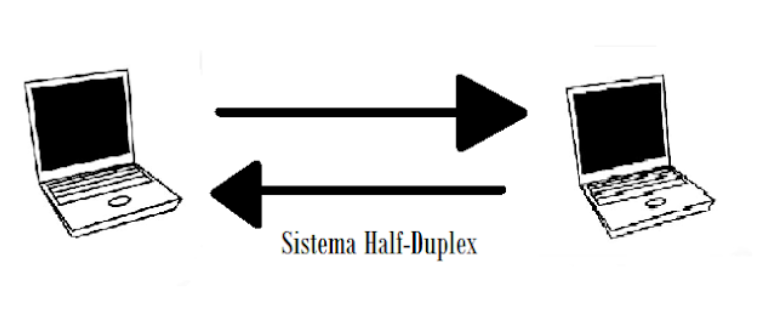

# Conteúdo de Redes 1

Esse documento é o meu resumo da matéria de Redes 1.

Sumário:

1.  [Modelo de camadas](#modelo-de-camadas)
1.  [Ondas](#ondas)
1.  [Modulação](#modulação)
    1.  [AM/ASK](#modulação-em-amplitude-amask)
    1.  [FM/FSK](#modulação-em-frequência-fmfsk)
    1.  [PM/PSK](#modulação-em-fase-pmpsk)
    1.  [QAM](#modulação-em-quadratura-de-amplitude-qam)
1.  [Codificação](#codificação)
    1.  [RZ](#return-to-zero-rz)
    1.  [NRZ](#non-return-to-zero-nrz)
    1.  [NRZ-I](#nrz-invert-on-ones-nrz-i)
    1.  [Manchester](#manchester)
    1.  [Manchester diferencial](#manchester-diferencial)
    1.  [AMI](#alternate-mark-invertion-ami)
1.  [Duplexação](#duplexação)
    1.  [Simplex](#simplex)
    1.  [Semi-duplex](#half-duplex-ou-semi-duplex)
    1.  [Duplex](#duplex-ou-full-duplex)
        1.  [TDD](#tdd-time-division-duplexing)
        1.  [FDD](#fdd-frequency-division-duplexing)
1.  [Multiplexação](#multiplexação)
    1.  [TDM](#tdm)
    1.  [FDM](#fdm)
    1.  [CDM](#cdm-multiplexação-por-divisão-de-código)
    1.  [OFMD](#ofmd-multiplexação-por-divisão-ortogonal-de-frequência)
    1.  [WDM](#wdm-multiplexação-por-divisão-de-comprimento-de-onda)
1.  [Duplexação + Multiplexação](#duplexação--multiplexação)
1.  [MAC](#mac)
    1.  [Aloha](#aloha)
    1.  [Aloha discreto](#aloha-discreto-slotted-aloha)
    1.  [CSMA](#csma-carrier-sense-multiple-access)
    1.  [CSMA não persistente](#csma-não-persistente)
    1.  [CSMA/CD](#csmacd)
    1.  [CSMA/CA](#csmaca)
    1.  [Passagem de bastão](#passagem-de-bastão)
1.  [LLC](#llc)
    1.  [Enquadramento](#enquadramento)
    1.  [Sequencialização](#sequencialização)
    1.  [Controle de fluxo](#controle-de-fluxo)
        1.  [Para-e-espera](#para-e-espera)
        1.  [Janela-deslizante](#janela-deslizante)
    1.  [Detecção de erros](#detecção-de-erros)
        1.  [Paridade horizontal](#paridade-horizontal)
        1.  [Paridade vertical](#paridade-vertical)
        1.  [Paridade longitudinal](#paridade-longitudinal)
        1.  [Checksum](#checksum)
        1.  [CRC](#crc-ciclic-redundant-code)

## Modelo de Camadas

Modelo OSI:

    +---------------------+
    |      Aplicação      |
    +---------------------+
    |     Apresentação    |
    +---------------------+
    |       Sessão        |
    +---------------------+
    |     Transporte      |
    +---------------------+
    |        Rede         |
    +---------------------+
    |       Enlase        |
    +---------------------+
    |       Física        |
    +---------------------+

Modelo TCP/IP:

    +---------------------+
    |      Aplicação      | (Aplicação + Apresentação)
    +---------------------+
    |         TCP         | (Sessão + Transporte)
    +---------------------+
    |         IP          |
    +---------------------+
    |       Enlase        |
    +---------------------+
    |       Física        |
    +---------------------+

Cada mensagem faz todo o caminho de envelopamento e desenvelopamento ao subir e
descer na pilha.

Cada camada só vê o que tem no cabeçalho da sua respectiva camada.

Todos os cabeçalhos adicionados na mensagem são sobrecarga. Aumenta o custo de banda.

### Camada Física

É o hardware da rede.

#### Antena

Pega um sinal analógico de dentro e joga para fora, ou vice-versa.

analógico <-> analógico

#### Hub

Espeta um cabo que envia o sinal e todos os outros cabos nele também recebem o
sinal.

#### Switch

Igual o hub, mas escolhe para quem vai enviar o sinal.

#### Placa de rede

digital <-> digital

#### Roteador

Igual o switch, mas para redes ao invés de cabos.

#### Satélite

Reflete o sinal.

#### MoDem 

ModuladorDemodulador.

Modulador: digital -> analógico.

Demodulador: analógico -> digital.

#### Cabos

Existem vários tipos de cabos:
*   Fibra
    *   Monomodal 

        Mais finos, portanto mais rápido e mais caro.

    *   Multimodal

        Mais largo, portanto mais lento e mais barato.

*   Par trançado
    *   cat 3
    *   cat 4
    *   cat 5
    *   cat 5e
    *   cat 6
    *   cat 7
    *   cat 8
*   Telefone
*   Coaxial
    *   Grosso
    *   Fino

### Camada de Enlase

Função:
1. cuidar da comunicação entre duas máquinas **diretamente** ligadas
   (fisicamente).

### Camada de Rede

Funções:
1.  Escolher qual rota vai ser feita (Roteamento).
2.  Identificar as máquinas (Endereço).
    
    Os endereços precisam ser únicos (IP).

### Camada de Transporte

Função:
1. Cuidar da comunicação da origem/destino.

Essa camada não liga para o meio.

Exemplo: cuida da ordenação das mensagens.

### Camada de Sessão

Função:
1. Separar os diferentes aplicativos.

### Camada de Apresentação

Função:
1. Uniformizar as requisições das aplicações.

### Camada da Aplicação

São todos os aplicativos.

Função:
1. Cuidar da interação com o usuário.

## Ondas

Ondas possuem:

* Comprimento: distância entre duas cristas ou dois vales.
* Amplitude: altura da onda.
* Frequência: número de vezes que a onda oscila por segundo.

A quantidade de frequências que você pode usar é limitada pela Anatel aqui no
Brasil.

Ondas sofrem com a **atenuação**.

Atenuação := Conforme a onda viaja, ela perde força.

Quanto maior a frequência, maior a atenuação.

Ondas com frequência maior possuem alcance menor.

Dados são transmitidos nas oscilações da onda. Logo, quanto maior a frequência,
maior a taxa de transmissão.

**Dilema**: encontrar o meio termo entre a taxa de transmissão e o alcance.

Operadoras de telefonia celular entendem que a melhor relação fica entre 700Mhz
e 4Ghz.

## Modulação

É a tranformação de uma onda digital em analógica.

Contrário: demodulação.

Utilizada quando o canal de comunicação é analógico.

Exemplo: Ondas de rádio para transmissão no ar.


### Modulação em amplitude (AM/ASK)

Sinal possui **duas amplitudes**, uma para o bit 0 e outra para o bit 1.

```
0: baixa amplitude.
1: alta amplitude.
```

A **frequência permanece constante**, muda somente a amplitude.

Exemplo:
* Rádios AM.

ASK := AM + portadora.

O recepetor precisa ver aonde está a crista da onda para ver se o bit é 0 ou 1.

### Modulação em frequência (FM/FSK)

Sinal possui **duas frequências**, uma para o bit 0 e outra para o bit 1.

```
0: baixa frequência.
1: alta frequência.
```

A **amplitude permanece constante**, muda somente a frequência.

Exemplo:
* Rádios FM.

FSK := FM + portadora.

Receptor precisa "contar" oscilações da onda para ver se o bit é 0 ou 1.

### Modulação em fase (PM/PSK)

Sinal possui **duas fases**, uma para o bit 0 e outra para o bit 1.

```
0: começa indo para cima.
1: começa indo para baixo.
```

**Amplitude e frequência permanecem constantes**.

Receptor precisa ver o "sentido" da onda para ver se o bit é 0 ou 1.

PSK := PM + portadora.

### Modulação em quadratura de amplitude (QAM)


QAM-4 := 4 amplitudes diferentes ou 2 amplitudes e 2 fases.
* transmite 2 bits de uma vez.

QAM-8 := 4 amplitudes + 2 fases.
* transmite 3 bits de uma vez.

QAM-...

Até onde podemos ir?
R: QAM-256.
* transmite 8 bits de uma vez.

Desvantagens do QAM-256:
* pontos das constalações ficam cada vez mais juntos, maior chance de erro.
* hardware cada vez mais sensível e caro.

Vantagens do QAM-256:
* correção de erro implícita e automática.

## Codificação

Codifica uma onda digital utilizada dentro do computador em uma onda digital
transmitida fora do computador.

Utilizada quando o meio de transmissão é digital.

Exemplo: Rede Ethernet.

Deve garantir a transmissão de dados e o sincronismo entre origem e destino.

Polaridade:
* Toda "onda" possui o repouso.
* Unipolar: um polo, além do repouso.
* Bipolar: dois polos, além do repouso.

### Return-to-zero (RZ)


```
1: pulso para cima.
0: pulso para baixo.
sempre volta ao repouso antes do fim do intervalo.
```

Bipolar.

2 oscilações/bit.

### Taxa de transmissão x Taxa de sinalização

Taxa de sinalização indica quantas oscilações o sinal pode efetuar por segundo.

Quem define a quantidade de dados que pode ser enviada é a taxa de sinalização.

Fazer a onda oscilar mais vezes do que o suportado pelo fio pode fazer o fio
esquentar e romper.

### Non-return-to-zero (NRZ)


```
1: pulso para cima.
0: fica no repouso.
```

Unipolar.

Pior caso NRZ: `01010101...010101`.

Problema do NRZ: quando não tem oscilações, não tem como sincronizar. Uma vez
perdido o sincronismo, deve-se reiniciar a transmissão.

O NRZ é ideal para:
* Transmissões a curta distência.
* Transmissões nas quais o sincronismo não é problema.

### NRZ Invert on ones (NRZ-I)


```
1: inverte a linha.
0: fica onde está.
```

Unipolar.

Pior caso do NRZ-I: `111...111`, porque tem 2 oscilações/bit.

Problema do NRZ-I: `000...000`, porque perde o sincronismo.

Solução: a cada 4 bits incluir um bit 1 na transmissão. O receptor deve retirar
o bit 1 adicional. Logo, para transmitir 8 bits de dados, deve-se transmitir 10
bits na linha.

### Manchester



```
1: para cima no meio do intervalo.
0: para baixo no meio do intervalo.
```

Unipolar.

Pior caso: sequência de 1s ou de 0s, porque precisa de 2 oscilações/bit.

Vantagem: código auto-sincronizável.

Desvantagem: transição no meio do intervalo carrega dados e sincronismo.

Uso: Ethernet.

### Manchester diferencial


```
sempre tem transição no meio do intervalo.
1: ausência de transição no início do intervalo.
0: presença de transição no início do intervalo.
```

Unipolar.

Pior caso: `000...000`, porque precisa de 2 oscilações/bit.

Vantagens:
* código auto-sincronizável.
* transição no meio carrega somente sincronismo.
* presença ou ausência de transição no início carrega os dados.

### Alternate Mark Invertion (AMI)


```
1: alterna um pulso para cima com um pulso para baixo.
0: fica no repouso.
```

Bipolar.

Pior caso: `111...111`, porque precisa de 2 oscilações/bit.

Problema: `000...000`, porque perde o sincronismo.

Vantagem: deteção de erro. Dois pulso pro mesmo sentido "seguidos" identifica um erro.

Uso: telefone fixo.

## Duplexação

### Simplex


Comunicação em sentido único.

Exemplo:
* Mouse.
* Teclado.
* Rádio.

### Half-duplex (ou Semi-duplex)



Comunicação em ambas as direções, porém nunca ao mesmo tempo.

Exemplo:
* Walk-talk.
* Email.

### Duplex (ou Full-duplex)


Comunicação em ambas as direções. Pode ser simultânea.

Exemplo:
* Telefone.
* Internet.

O objetivo é criar um canal duplex. Isso pode ser feito com dois simplex, mas -
se isso não for possível - usamos duplexação.

#### TDD (Time Division Duplexing)


Fatia o tempo do canal em slots.

Em um slot transmite e no outro recebe.

É necessário ter um tempo de guarda entre os slots, porque a inversão não é
instantânea. Isso evita colisões.

A transissão ocorre tão rápido que considera-se um duplex.

#### FDD (Frequency Division Duplexing)


Divide a frequência disponível em duas. Uma faixa de frequência transmite e
outra recebe.

#### TDD vs FDD

TDD:
* Máquina transmite utilizando toda a banda pela "metade" do tempo.
* Precisa de um intervalo de tempo (intervalo de guarda) entre transmissão e
  recepção para inverter o canal.
* Redes sem fio (wifi).

FDD:
* máquina transmite utilizando "metade" da banda todo o tempo.
* Precisa de duas antenas (uma para receber e uma para transmitir) ou de uma
  antena capaz de realizar as duas tarefas simunltâneas.
* Telefonia celular.

## Multiplexação

Múltiplos clientes (computadores) conversam com o servidor.

Simplex. 

### TDM


Fatia o tempo do canal entre os usuários e entrega um slot para cada um.

Deve ter um tempo de guarda entre cada slot.

Cada máquina transmite por um tempo utilizando todo o canal.

Quadro := sequência de slots sem repetição.

Os quadros são repetidos indefinidamente no canal.

O que ocorre se um slot ficar vazio?

R: O slot pertence a máquina, se ela não quer transmitir, ele fica vazio.

#### TDM x TDMA

Time Division Multiplexing:
* diversas transmissões simultâneas.
* podem ser de uma mesma máquina.

Time Division Multiple Access:
* exatamente o mesmo conceito, mas aplicado a máquinas diferentes.
* exemplo: diversos celulares conversando com a torre ao mesmo tempo.

#### Melhorias

TDM com servidor:
* ao invés de ter slots fixos para as máquinas existe um servidor na rede.
* máquinas devem pedir slots livres para o servidor.
* devem informar por quanto tempo vão utilizar o canal.
* servidor aloca slots enquanto tiver livre.
* pode alocar um ou mais slots para cada máquina.
* depois avisa que está ocupado e máquinas devem esperar.
* custo a mais por esse gerenciamento.

TDM com reserva:
* igual ao TDM com servidor, mas o servidor aceita reservas futuras.

### FDM


Fatia o tamanho do canal (a faixa de frequência) em bandas menores (canais
menores) e entrega um canal pequeno para cada usuário.

Deve ter uma frequência guarda entre cada canal.

Cada máquina transmite todo o tempo utilizando um canal pequeno (velocidade
reduzida).

#### FDM x FDMA

Frequency Division Multiplexing:
* diversas transmissões simultâneas.
* podem ser de uma mesma máquina.

Frequency Division Multiple Access:
* exatamente o mesmo conceito, mas aplicado a máquinas diferentes.

### CDM (Multiplexação por Divisão de Código)

Baseada nas funções de Walsh. Cada máquina recebe uma função de Walsh para
utilizar. A função define o formato da onde que a máquina deve transmitir.

Todas as máquinas transmitem utilizando o canal todo, todo o tempo. Elas se
somam, mas é possível que o receptor separe as ondas e identifique cada sinal.
O receptor faz meio que um casamento de padrões.

Permite 32 transmissões simultâneas.

#### Problemas

1. Para funciona, todas as máquinas devem iniciar a transmissão de cada bit ao
   mesmo tempo (transmissões sincronizadas).
2. Tempo para transmitir um bit é maior que em TDM e FDM.

#### CDM x CDMA

Code Division Multiplexing:
* diversas transmissões simultâneas.
* podem ser de uma mesma máquina.

Code Division Multiple Access:
* exatamente o mesmo conceito.
* mas aplicado a máquinas diferentes.

### OFMD (Multiplexação por Divisão Ortogonal de Frequência)


Parecida com FDM, mas os sub-canais são sobrepostos. Isso resulta em um número maior de sub-canais maiores.

O pico de cada frequência é único e o resto pode se sobrepor.

Uma das multiplexações mais modernas e mais avançadas utilizadas hoje em dia.
Utilizado em todas as redes sem fio.

### WDM (Multiplexação por Divisão de Comprimento de Onda)


Similar ao FDM, mas - ao invés de utilizar a frequência como parâmetro para a divisão - utiliza o
comprimento de onda.

Utilizado em fibra ótica.

## Duplexação + Multiplexação

Duplexação:
* Permite enviar e receber em um canal (Duplex).
* Somente duas máquinas conectadas.

Multiplexação:
* Permite muitas máquinas compartilharem o canal.
* Simplex.

É possível unir as duas técnicas. Ou seja, multiplas máquinas dividindo um
canal com transmissão bidirecional.

### TDD + TDM


Dois grupos: upload e download. Um slot para cada máquina fazer upload. Um slot
para cada máquina fazer download.

Quadro := parte de upload + download.

### TDD + FDM


Dividir a frequência para cada máquina e, dentro de cada frequência, dividir em
slots de tempo para upload e download.

### FDD + TDM


Duas frequências: uma para upload e outra para download. Um slot de tempo para
cada máquina.

Mais utilizado.

### FDD + FDM


Dois frequências: upload e download. Dentro de cada frequência, uma frequência
para cada máquina.

### Existem mais possibilidades

CDM + TDD, CDM + FDD, OFDM + TDD, OFDM + FDD, etc.

## Enlace

Responsável pela comunicação de duas máquinas diretamente conectadas.

Dividido em duas sub-camadas:
1.  Controle de Acesso ao Meio (MAC)

    Responsável por definir quais máquinas e por quanto tempo podem utilizar o
    meio de transmissão.

2.  Controle Lógico de Enlace (LLC)

    Possui 4 funções:

    1. Enquadramento
    2. Sequencialização
    3. Detecção de erros
    4. Controle de fluxo

### MAC

Definir quais máquinas podem usar o meio.

Definir por quanto tempo as máquinas podem usar o meio.

Similar as técnicas de multiplexação, mas multiplexação precisa de uma
pré-definição ou de um servidor definindo a forma de uso do
tempo/frequência/código.

Aqui, a ideia é fazer tudo distribuído, sem nenhum servidor ou pré-definição.

#### Aloha

Utilizado em uma das primeiras redes criadas no mundo (AlohaNet).

AlohaNet:
* Foi criado em 1970.
* Rede sem fio criada pela universidade do Havaí.
* uma das primeiras redes do mundo.
* primeira rede sem fio do mundo.
* interligava os campus da universidade do Havaí.

Simplesmente manda dados para quem quiser, quando quiser.

Problema: muitas colisões.

`~[10, 20]% de taxa de entrega.`

#### Aloha discreto (Slotted Aloha)

Tentativa de resolver o problema de colisões.

Máquinas devem ouvir antes de transmitir.

```
Se tiver uma transimissão em andamento:
	Máquina deve esperar a transmissão acabar.
Senão: # canal está livre
	Pode transmitir.
```

`~[30, 40]% de taxa de entrega.`

#### CSMA (Carrier Sense Multiple Access)

Adaptação do Aloha discreto para ser utilizado no fio (barramento).
Rede em broadcast.

Basicamente é um Aloha discreto portado para dentro do fio.

#### CSMA não persistente.

Caso o canal esteja ocupada estabelece uma espera aleatória para tentar
novamente.

Intervalo de espera é um valor inteiro entre `(0, 2^n-1]`, onde n é o número de
tentativas de transmitir esta mensagem.  Depois de `n = 11`, n fica constante.
`n = 16` significa pânico na rede, desiste da transmissão.

#### CSMA/CD


Baseado no CSMA não-persistente.

**Com Collision Detection.**

Enquanto transmite fica ouvindo o canal. Se detectar colisão, para de
transmitir. A colisão sempre acontece no início da transmissão.  Depois que o
cabo está "cheio" não pode mais ocorrer colisão, pois máquinas devem ouvir
antes de transmitir.

Quando os bits colidem, eles fazem um OR e tudo vira uma sequência de 1s.
Uma máquina coloca 0 no fio e ouve 1. Logo, ela percebe que ouve uma colisão.

A colisão só pode ocorrer nos primeiros 64 bytes da transmissão. Isso limita o
tamanho da rede. O sinal deve atingir toda a rede dentro do tempo necessário
para transmitir 64 bytes.

Vantagens:
* Se der colisão, transmite somente 64 bytes e para.
* Não gasta tempo da rede transmitindo mensagens que vão ser jogadas fora.

`~92% de taxa de entrega.`

Utilizado na Ethernet.

#### CSMA/CA

Novas redes sem fio não conseguiram usar CSMA/CD, porque não da pra transmitir
e ouvir ao mesmo tempo.

Volta ao CSMA, problema da colisão volta.

Problema novo: problema do terminal oculto.


Solução: CSMA com Collision Avoidance.

Duas novas mensagens:
* RTS (Request-To-Send)
* CTS (Clear-To-Send)


Pode ocorrer colisão em mensagens RTS e CTS.

Vantagem: mensagens RTS e CTS são mensagens pequenas, perto de 64 bytes.

Desvantagem: precisa enviar 1 mensagem RTS e 1 CTS pelo menos para cada mensagem de dados.

#### Passagem de bastão


Como uma corrida de revezamento. O bastão vai passando pela rede. Quem está com
o bastão pode transmitir. Se tudo funcionar corretamente, não tem colisão.

Duas formas de fazer a passagem de bastão:
1. Temporização do bastão.
    * Acabou meu tempo? Então passa o bastão.
	* Problema: perde tempo quando não está transmitindo.
2. Antecipação do bastão.
    * Não vou enviar nada, então passa o bastão.
	* Problema: quando ninguém quer transmitir nada.

#### Resumo

Rede com fio: CSMA/CD.

Rede sem fio: CSMA/CA.

Anel: passagem de bastão.

Porque não usar CSMA/CA em redes com fio? Overhead do RTS/CTS.

### LLC

O LLC (Logical Link Control) possui 4 tarefas:
1. Enquadramento
2. Sequencialização
3. Detecção de erros
4. Controle de fluxo

#### Enquadramento

Em transmissões assíncronas, a origem deve sinalizar aonde começa e aonde
termina as mensagens.

Duas formas de fazer isso:
1.  Delimitador de início + delimitador de fim.

    Problema: se o delimitador de fim aparecer dentro da mensagem.

    Solução: se encontrar um 0 seguido por 5 1s, adiciona mais um 0. Quando o
    receptor receber, ele remove esse 0.

2.  Delimitador de início + campo de tamanho.

##### Comparativo

Delimitador de fim:
* Mensagens sem limite de tamanho.
* Deve procurar o delimitador de fim no meio da mensagem para alterá-lo.

Campo tamanho:
* Mensagens com tamanho máximo (maior número que pode ser representado no campo
  tamanho).
* Pode ter qualquer sequência nos dados.

#### Sequencialização

Deve indicar a sequência correta que as mensagens saíram da origem.

Adiciona-se um campo na mensagem com um número sequencial de 0 a XX. XX é o
maior número que pode ser representado com a quantidade de bits do campo
tamanho.

Cuidado, a sequência deve ser sem sinal (unsigned). Quando estourar o contador,
ele deve voltar a 0. Por exemplo, se for de 8 bits, vai de 0 a 255.

#### Controle de Fluxo

Duas formas de fazer:
1. Para e espera
2. Janelas deslizantes

##### Para e espera.

Utilizado em redes semi-duplex.

Envia uma mensage, para e fica esperando uma resposta.

Envia uma mensagem de cada vez.

Os timeouts são sempre no lado do cliente.

##### Janelas deslizantes.

Utilizado em redes duplex.

Define uma "janela" com X mensagens. Pode enviar até X mensagens sem receber
nenhuma confirmação.

Aceitação coletiva: qualquer resposta (ACK ou NACK) da mensagem 4 (por exemplo)
aceita todas as mensagens transmitidas antes da 4.

As janelas podem mudar de tamanho.

Existem duas formas de implementar as janelas deslizantes:

1.  Volta-N.

    Quando há um NACK, retransmite toda a janela a partir da que deu erro.

    Usado em redes nas quais você tem muito erro.

2.  Repetição seletiva.

    Quando há um NACK, retransmite só o que deu erro dentro da janela ou o que
    é novo na janela.

    Usado em redes nas quais você tem pouco erro.

#### Detecção de erros

Função: **descobrir** que ocorreu erro durante a transmissão.

##### Paridade horizontal

Adicionar um bit em cada linha indicando se a quantidade de 1s é par (ou
ímpar).

Faz um XOR bit a bit e o resultado é o que vai no campo de paridade.

Problema: inverte 2 bits na mesma linha.

##### Paridade vertical

Adicionar um bit em cada coluna indicando se a quantidade de 1s é par (ou
ímpar).

Problema: inverte 2 bits na mesma coluna.

##### Paridade longitudinal

Paridade horizontal + vertical.

Problema: inverte um quadrado 2x2.

Sobrecarga: 1 bit para cada byte + 1 byte.

##### Checksum


1. Soma os dados.
2. Trunca o resultado para 8 bits.
3. A checksum é o que falta pra número do item 2 dar 0.

O checksum é o complemento da soma dos dados.

Manda no final da mensagem o checksum e checa se deu 0 a soma do checksum com
a mensagem.

Sobrecarga: 1 byte.

##### CRC (Ciclic Redundant Code)


Mensagem original + polinômio gerador.

O resto é somado na mensagem truncada.

No receptor, o resto da divisão tem que ser 0.

Sobrecarga: n bits adicionais (n é o grau do nosso polinômio).

## Referências

* <https://www.youtube.com/watch?v=-Us6uoQVHOI&list=PLM3N1gr3bmJaVBCbTtdZrK91GyzSsnwlV&index=1>

