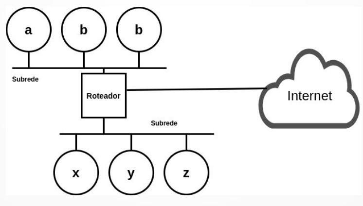
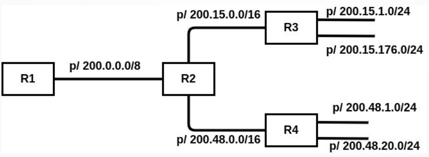
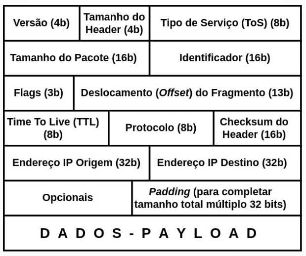
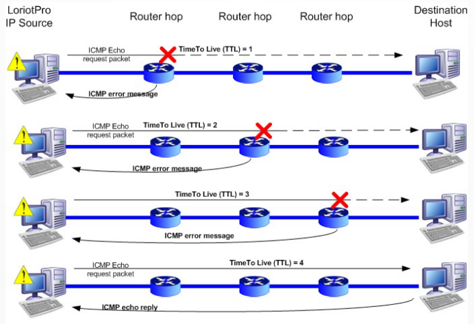

# Resumo para a P1 de Redes 2

## Ethernet

A rede cabeada mais popular do mundo.

A Ethernet é uma **família** de redes.

Classificação de redes locais:
1.  Redes "de escritório":

    Usa Ethernet, que é uma rede best-effort (IEEE 802.3).

    TokenRing (IEEE 8025).

2.  Redes industriais:

    Token Bus (IEEE 802.4). 

Topologia original: barramento. Hoje em dia: switch.

Na Ethernet, 1 enlace é compartilhado por **todas** as máquinas.

O quadro Ethernet se manteve o mesmo ao longo da evolução da Ethernet.

### Quadro Ethernet

```
|-------------------------------------------- Header -------------------------------------------|-------- Payload --------|--- Trailer ---|

+---------------------+---------------------------+----------------------------+----------------+-------------------------+---------------+
| Preâmbulo (8 bytes) | Endereço Origem (6 bytes) | Endereço Destino (8 bytes) | Tipo (2 bytes) | Dados ([46,1500] bytes) | CRC (4 bytes) |
+---------------------+---------------------------+----------------------------+----------------+-------------------------+---------------+
```

Preâmbulo: os 7 primeiros bytes é 10101010 e 8º byte é 10101011.

Endereços: endereços físicos (MAC address). Deveriam ser únicos.

Tipo: identifica o protocolo que está comunicando sobre a rede Ethernet.

### CSMA/CD 1-persistente

O Protocolo MAC (Medium Access Control) é o CSMA/CD 1-persistente. É ele que
permite que diversas máquinas compartilhem o mesmo meio sem se colidirem.

CS (Carrier Sense) : o tempo todo a placa escuta o meio.

MA (Multiple Access): todas as máquinas transmitem na mesma faixa de frequência.

CD (Collision Detection): processo analógico que transmite e detecta colisão.

Quando deseja transmitir, a máquina escuta o meio. Se estiver ocupado, continua
escutando até liberar e - então - transmite.

1-persistente (100% persistente): 

A Ethernet é sempre 1-persistente, mas existe alternativas:
1.  p-persistente.

    Exemplo, 0.5-persistente.

    Quando o meio libera, transmite com probabilidade de 50%.

2.  não-persistente.

    Ao escutar o meio ocupado, desiste de transmitir e volta a escutar depois
    de um intervalo de tempo aleatório.

Acontecendo a colisão, o que fazer?

-   Solução 1: Algoritmo Binary Exponential Backoff.

    Aconteceu a 1ª colisão?

    Espera 0 ou 1 intervalo de tempo para tentar de novo.

    Aconteceu a 2ª colisão?

    Espera 0, 1, 2 ou 3 intervalos de tempo para transmitir.

    Aconteceu a 3ª colisão?

    Espera 0, 1, 2, 3, 4, 5, 6 ou 7 intervalos de tempo para transmitir.

    Aconteceu a i-ésima colisão?

    Espera $0, 1, ..., 2^i - 1$ intervalos de tempo para transmitir.

    $i \in [0, 10]$

    Aconteceu a 16ª colisão?

    Desiste.

As redes probabilisticas só podem ser usadas em um ambiente de "escritório".
Redes industriais (usina, por exemplo) precisam ser determinísticas.

## Internet

-   A internet com i minúsculo é uma rede de redes.

-   A Internet com i maiúsculo é a rede mundial que conecta diversos (todos) os
    tipos de rede.

-   A Internet é uma rede virtual, ela não se preocupa com a parte física.

-   Os protocolos da Internet é constituída por software que implementa os
    protocolos da família TCP/IP.

-   A Internet é um software que permite a comunicação universal de máquinas
    conectadas a redes físicas das mais diversas tecnologias.

-   O 1º passo para implementar a Internet é ter uma estratégia de
    identificação mundial (endereços IP). Lembrando que é necessário
    identificar redes e máquinas.

### Arquitetura da Internet

-   A Internet moveu a confiabilidade da comunicação para as pontas.
-   Na ponta os hosts verificam se pacotes foram perdidos, duplicados, se estão
    fora de ordem, etc.
-   Quem faz essa verificação?
    - ou algum protocolo de transporte (TCP).
    - ou algum protocola de aplicação.


Backbone: rede física que conecta redes físicas.

## ARP

-   Address Resolution Protocol
-   Antes da comunicação acontecer na rede física é preciso converter o
    endereço IP em endereço físico.
-   Conversão de um endereço **IP** para um endereço **físico** (o MAC address).
-   Mapeamento direto: usa o host-id como endereço físico.
-   Mapeamento indireto: usa o MAC address como endereço físico.
-   O ARP é um protocolo "request/reply".
-   ARP request: envia a mensagem de busca do endereço físico no **broadcast**
    da LAN.
-   ARP reply: a máquina com o IP correspondente responde com o seu endereço
    físico, também em broadcast.
-   Tabela cache ARP: ao descobrir um par de endereço IP e físico, o host
    armazena localmente em sua tabela cache. Dessa forma, antes de fazer um ARP
    request, o host verifica se já não tem a reposta em sua tabela cache.
-   O ARP é um protocolo definido na camada de Enlace.
-   O ARP vai dentro de um quadro Ethernet.

    ```
    +---------------------------------+--------------------------------+
    | Tipo Rede Física (Ethernet = 1) | Tipo Endereço (IP = 0800 hexa) |
    +---------------------------------+--------------------------------+
    | # Bytes do endereço físico      | # Bytes do endereço mapeado    |
    +---------------------------------+--------------------------------+
    | Operação (Request ou Reply)                                      |
    +---------------------------------+--------------------------------+
    | Endereço Físico Origem          | Endereço IP Origem             |
    +---------------------------------+--------------------------------+
    | Endereço Físico Destino         | Endereço IP Destino            |
    +---------------------------------+--------------------------------+
    ```

## RARP

-   Reverse ARP.
-   Mapeamento de um endereço físico para um endereço IP.
-   Usado em máquinas diskless.
-   Também é feita em broadcast.
-   A própria máquina solicita o seu endereço IP e um servido RARP que
    responde.
-   O protocolo RARP é pouco usado, normalmente usa-se mais o BOOTP ou o DHCP.

## IP

-   Protocolo não-confiável: não tem garantia de que o pacote chegou.
-   Protocolo não-orientado à conexão: não garante que chegou na ordem correta.

### Endereços IPv4

-   Cada máquina (host) da Internet está conectado a uma rede física e tem um
    endereço físico naquela rede física.
-   O endereço IP é a base para o roteamento.
-   Em binário (para máquinas) e em decimal (para humanos).
-   Além disso, posso associar às máquinas nomes simbólicos (DNS), como
    www.inf.ufpr.br.

Total 32 bits (4 bytes) divididos em duas partes:
1. NET-ID: identificador da rede.
2. HOST-ID: identificador do host.

Originalmente, os endereços IP foram organizados em classes:
-   Classe A:

    ```
        | 1 byte | 3 bytes |
    +---+--------+---------+
    | 0 | NET-ID | HOST-ID |
    +---+--------+---------+
    ```

    Poucas redes e muitos hosts.

-   Classe B:

    ```
         | 2 bytes | 2 bytes |
    +----+---------+---------+
    | 10 | NET-ID  | HOST-ID |
    +----+---------+---------+
    ```

    "Intermediária": no máximo 65 mil hosts.

-   Classe C:

    ```
          |  3 bytes  |  1 byte |
    +-----+-----------+---------+
    | 110 |  NET-ID   | HOST-ID |
    +-----+-----------+---------+
    ```

    Muitas redes e poucos hosts.

-   Classe D: Multicast

    Permite a definição de grupos de destinatários.

-   Classe E: Reservada para uso futuro.

Unicast: um para um.

Broadcast: um para todos.

Multicast: um para um grupo.

Anycast: um para um membro do grupo.

CDN (Content Delivery Network): cache de conteúdos para aumentar a velocidade
para o usuário final.

VPN (Virtual Private Network): estabelece uma conexão segura na Internet.

Endereço IP:
-   Especifca uma conexão a uma rede da Internet.
-   Não é um endereço da máquina propriamente dita. Se um host muda de rede,
    então seu endereço IP também muda.

Na Internet as máquinas são ou hosts ou roteadores:
-   Host: máquina conectada a 1 rede.
-   Roteador: máquina conectada a 2 ou mais redes. Uma máquina que conecta duas
    redes. O Roteador tem 1 endereço IP em cada uma das redes que ele está.

#### Endereços especiais

1. Broadcast

    ```
    HOST-ID = 11111111111111111111111111111111
    ```

2. Própria rede

    ```
    HOST-ID = 00000000000000000000000000000000 (usado para referenciar a rede)
    ```

3. Loopback

    Usado para enviar uma mensagem de uma máquina para a própria máquina.

    ```
    127.0.0.1 ("home")
    ```

### Como IP faz o roteamento?

-   Quando chega um pacote para ser encaminhado, o roteador IP extrai o net-id
    e faz uma busca na Tabela de Rotamento (ou Tabela IP).

    ```
    +----------------+---------------+
    | NET-ID DESTINO | PRÓXIMO PASSO |
    +----------------+---------------+
    | net-id A       | R1            |
    +----------------+---------------+
    | net-id X       | R3            |
    +----------------+---------------+
    | nenhum acima   | Rdefault      |
    +----------------+---------------+
    ```

-   Cada roteador decide com base na sua tabela local.
-   Pode acontecer loops.

#### Tipo 1

-   Endereço IP destino = endereço IP origem ou endereço IP destino =
    127.0.0.1.
-   Origem e destino no mesmo host.
-   Comunicação entre processos locais.
-   A comunicação nem chega na placa de rede.

#### Tipo 2

-   net-id do destino = net-id da origem, mas host-id destino != host-id origem.
-   Origem e destino estão na mesma rede local.
-   Antes de comunicar o IP chama o ARP sempre.

#### Tipo 3

-   net-id da origem != net-id do destino.
-   Origem e destino estão em redes diferentes (possivelmente vários roteadores
    no meio).

### Manipulação de endereços IP

#### Proxy ARP

-   Proxy: um intermediário. A origem comunica-se com o proxy e o proxy
    comunica-se com o destino.
-   Existem vários usos para um Proxy: cache, reforço de segurança, proxy de
    roteamento, etc.
-   A Proxy ARP é usada para permitir que 2 redes físicas tenham o mesmo
    net-id.
-   Como ela faz isso? Quando uma máquina de um rede que falar com a outra, ela
    faz um requisição ARP e o Proxy ARP responde com seu próprio endereço,
    porque ele mantém uma tabela completa de todos os endereços de ambas as
    redes.

#### Subnet

-   Usado no mesmo contexto que o Proxy ARP, mas a Subnet é uma solução na
    camada de rede ao invés da camada de enlace. 
-   Empregam roteadores internos à organização.



-   Como o roteador faz para saber a rede destinatária usando apenas o endereço
    IP?
-   Solução: "empresta" alguns bits do host-id para endereçar as redes internas.
-   Uma **máscara de subrede** é usada para determinar quantos bits estão sendo
    "emprestados" do host-id.

Máscara de rede:
-   Mesmo número de bits do endereço.
-   Se o bit for 1, então o bit do endereço é do net-id.
-   Se o bit for 0, então o bit do endereço é do host-id.

Exemplo:

Considere o endereço IP 192.39.100.86 e a máscara de rede 255.255.255.192.

Responda:
-   Até quantas subredes a organização possui?

192 = 1100000

R: A organização possui até 4 subredes, pois são emprestados 2 bits do host-id
para a subrede.

-   Qual host de qual subrede está sendo endereçado?

192 = 11000000

Então, o endereço 192.39.100.36 é da classe C, porque começa com 110.
192.139.100 é do net-id e 86 é do host-id.

86 = 01010110: 01 da subrede e 010110 (22) do host.

R: O host 22 da subrede 192.39.100.64.

#### CIDR

-   Elimina as classes. Na verdade, reorganiza os endereços IPv4 remanescentes:
    mais de 2 milhões de net-ids.
-   O CIDR flexibiliza a fronteira entre net-id e host-id.
-   Os net-ids CIDR vão de 13 a 27 bits. Logo, sobram de 5 a 19 bits para o
    host-id.
-   O prefixo CIDR é indicado como sufixo. Exemplo: 200.17.212.179/25. Isso
    indica que 25 bits do prefixo do endereço são o net-id.
-   No roteamento hierárquico, o prefixo CIDR é usado para indicar quais bits o
    roteador deve examinar para rotear.



### O datagrama IPv4



-   Versão: permite a coexistência de versões.
-   Número de bytes header:
    -   Indica que o header tem tamanho variável. Varia por conta dos
        opcionais, que só são usados em organizações, internamente. Sem
        conectar a internet.
    -   O tamanho é contado em palavras de 4 bytes.
    -   Sem opcionais: 20 bytes de header.
-   ToS (Type Of Service):

    Originalmente:

    ```
    +---------------------+---------------+--------------------+---------------------+----------------------------+
    | Prioridade (3 bits) | Delay (1 bit) | Throughput (1 bit) | Reliability (1 bit) | Reservados futuro (2 bits) |
    +---------------------+---------------+--------------------+---------------------+----------------------------+
    ```

    Existem 2 arquiteturas de QoS (Quality Of Service): IntServ e DiffServ.

    O DiffServ redefiniu o campo ToS:

    ```
    +-------------------------------------+-----------------------------+
    | Código de QoS da aplicação (6 bits) |  Reservados futuro (2 bits) |
    +-------------------------------------+-----------------------------+
    ```

    No entanto, hoje em dia é usado o conceito de Over-Provisioning: os
    provedores devem ter uma capacidade 2x maior que a demanda estimada.

-   Tamanho do pacote: número de bytes total do pacote IP.
    
    No máximo 64K bytes. No entanto, há um limite de rede física (MTU - Maximum
    Transfer Unit).

    O MTU da Ethernet é de 1500 bytes. Pacotes maiores do que isso são fragmentados.

    Fragmentação do pacote IP:
    -   Dividir um pacote em fragmentos menores, que caibam no MTU.
    -   Offset: deslocamento do fragmento com relação ao início do pacote
        original.
    -   Flags:
        -   MORE: indica se há mais fragmentos (1) ou se é o último (0).
        -   DON'T FRAGMENT: indica que é proibido fragmentar. Exemplo: em
            implementações mínimas do IP.
    -   Os fragmentos sempre são montados apenas no destino final.
    -   Roteadores intermediários podem fragmentar denovo usando a mesma
        estratégia (fragmentação de fragmentos).

-   TTL (Time To Live)
    -   Os roteadores tomam decisões independentes.
    -   O TTL resolve o problema do loop de rede.
    -   Apesar de que o campo TTL determina um "tempo máximo" que o pacote pode
        permanecer na rede, isso é feito de forma indireta. O TTL informa o
        número máximo de roteadores pelos quais o pacote pode passar (hops).
    -   Cada roteador que processa o pacote faz TTL = TTL - 1. Se TTL = 0,
        então o pacote é descartado.
    -   Geralmente, 64 ou 128.
-   Protocolo
    -   Indica qual protocolo está usando o IP para se comunicar.
    -   Identificadores definidos pela IANA.
    -   Lembrar que o IP não gera pacotes "espontaneamente".
-   Checksum
    -   Código de detecção de erros da Internet.
    -   Calculado apenas sobre o Header:
        -   Trata o header como uma sequência de palavras de 16 bits.
        -   Soma as palavras usando soma de complemento de 1.
        -   Soma de complemento de 1: igual soma binária. Se no final vai 1,
            então soma +1. Depois da soma, tira o complemento do resultado.
        -   Ao final, tira o complemento do resultado. Se der 0, então não teve
            erro.
-   Opcionais
    -   Quase sempre desabilitado nos roteadores, em geral descartam pacotes
        com opcionais.
    -   Existe toda uma sequência de opcionais de segurança.
    -   Os demais, são relacionados à roteamento:
        -   Source route (roteamento de origem): determina a sequência de
            roteadores pelos quais o pacote deve passar.
            -   Strict: ordem estrita.
            -   Loose: ordem aleatória.
        -   Record route: o pacote vai gravando os endereços dos roteadores no
            qual passa.
        -   Timestamp: grava o tempo em UTC.
-   Padding
    -   O número de bits tem que ser múltiplo de 32. Caso contrário, acrescenta
        padding.

## ICMP (Internet Control Message Protocol)

-   Mensagem de controle e mensagem de erro.
-   Toda implementação de protocolo IP deve, obrigatoriamente, vir acompanhada
    de uma implementação do ICMP.
-   Se um pacote trafegando entre origem e destino sofre um erro e tem que
    descartado, então uma mensagem ICMP é transmitida para a origem.

O IP é um protocolo não confiável e não orientado à conexão. O ICMP torna o IP
confiável?

R: Não, o ICMP é transmitido em cima do protocolo IP. Além disso, não são
geradas mensagens ICMP sobre pacotes que carregam mensagens ICMP.

-   Mensagem ICMP:

    ```
    +---------------+------------------+--------------------+
    | Tipo (8 bits) |  Código (8 bits) | Checksum (16 bits) |
    +---------------+------------------+--------------------+
    | Dados (Payload)                                       |
    +-------------------------------------------------------+
    ```

-   Tipo 0: echo request/reply.
    -   É o comando ping.
    -   Se o Echo Reply retornar corretamente, então todos os protocolos das
        camadas 1 até 3 estão funcionando corretamente entre origem e destino.
    -   Não diz sobre os protocolos das camadas de transporte e aplicação.
-   Tipo 3: destination unreachable.
    -   O destino está inatingível.
    -   O campo "código" explicita de que se trata:
        -   0: rede inatingível.
        -   1: host inatingível.
        -   2: protocolo inatingível.
        -   3: porta inatingível.
        -   4: fragmentação necessária/flag "Don't fragment" setado.
        -   5: source routing falhou.
        -   etc.
-   Tipo 11: time exceeded.
    -   Gerado quando TTL = 0 e o pacote é descartado.
    -   O camando `traceroute <destino>` retorna a sequência de roteadores
        pelos quais o pacote passa até chegar ao destino.

    Envia um pacote com TTL = 1. Depois TTL = 2 e vai indo até chegar ao
    destino.

    

-   Tipo 4: source quench.
    - Rede congestionada: pacotes estão chegando aos roteadores em taxas
      maiores que conseguem processar. Resultado: os pacotes são descartados.
    - O congestionamento é uma situação horrível, pois gera um efeito bola de
      neve.
    - Só existe uma solução para o congestionamento: reduzir as taxas de
      transmissão de pacotes.
    - Isso que o pacote com source quench indica: reduza a taxa de transmissão
      de pacotes.
-   Tipo 12: paramater problem.
    -   Problemas não identificados com outras mensagens.
    -   É uma espécie de mensagem "coringa".

## Camada de transporte


-   Os protocolos de transporte usam "portas" para identificar processos que se
    comunicam.
-   Portas são números de 16 bits.
-   É importante saber que as portas TCP e UDP são completamente disjuntas.
    Pode existir um processo na porta UDP 1500 e outro na TCP 1500 sem
    problemas.
-   O par (endereço IP, porta) identifica qualquer processo no mundo!
-   As portas de 0 até 1023 são reservadas - pela IANA - para protocolos
    padronizados.

### UDP

-   User Datagram Protocol.
-   Usado para processos se comunicarem entre si.
-   Não confiável.
-   Não orientado à conexão.
-   Apesar de poder ser chamado de datagrama, é importante lembrar que o pacote
    da camada de transporte é nomeado segmento.
-   Datagrama UDP:
    
    ```
    +---------------------------------+--------------------------------+
    | Porta de origem (16 bytes)      | Porta de destino (16 bytes)    |
    +---------------------------------+--------------------------------+
    | Tamanho do datagrama (16 bytes) | Checksum (opcional) (16 bytes) |
    +---------------------------------+--------------------------------+
    | Payload                                                          |
    +---------------------------------+--------------------------------+
    ```

    -   Checksum
        -   Por default ligado, porque o IP só calcula o checksum do header.
        -   Desligado em casos de benchmarks.
-   UDP também usa ICMP (protocolo da camada 3) para reportar alguns erros (por
    exemplo, port unreachable).
